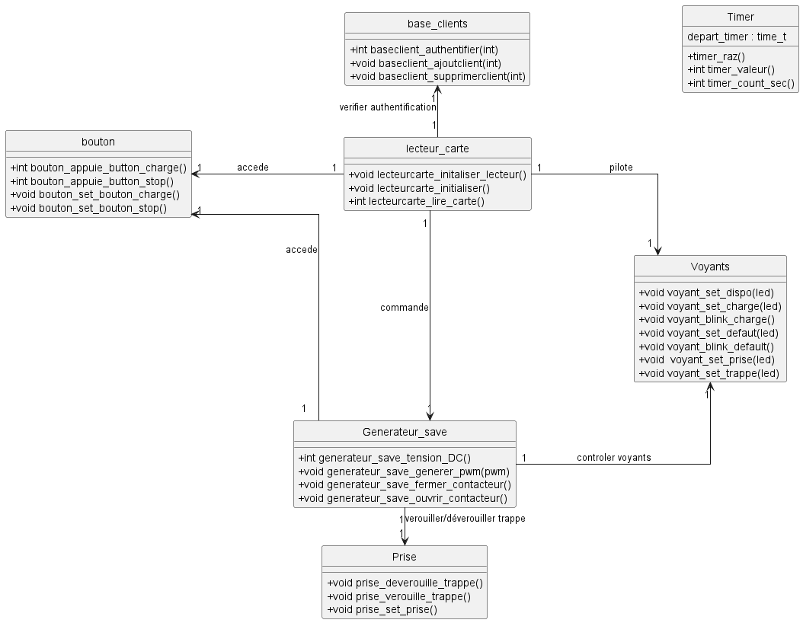
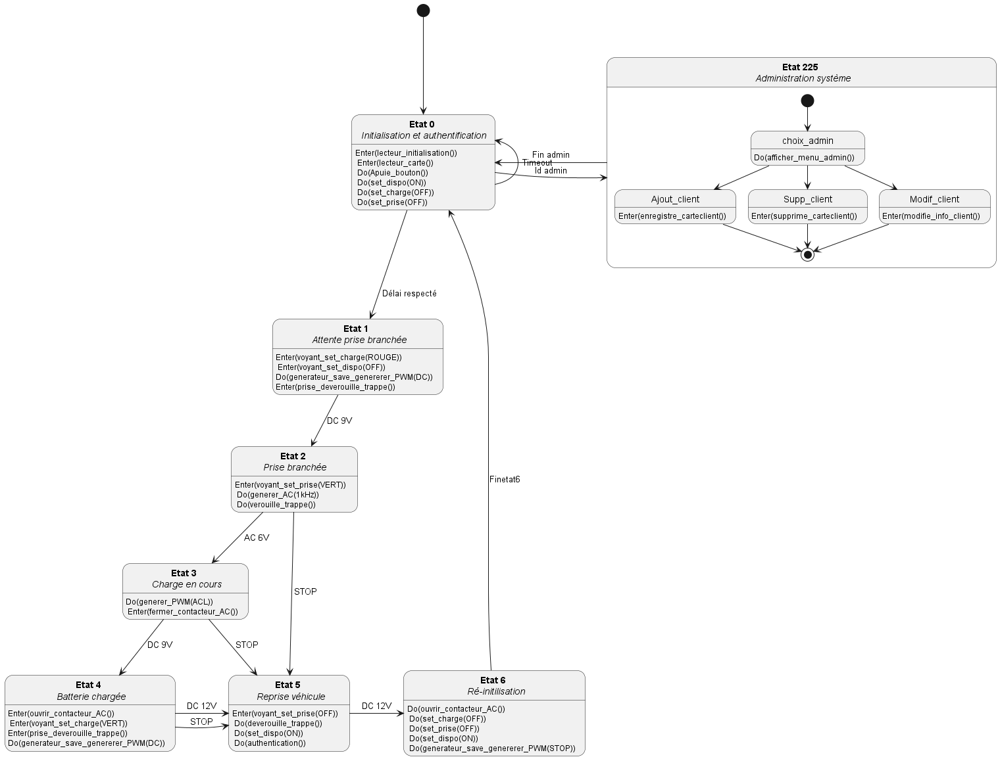

# Projet-de-Conception-de-Gestion-de-System-de-Recharge-de-Voiture-Electrique

*Overview*

Le but de ce projet est de concevoir un logiciel permettant de gérer une borne de recharge pour véhicules électriques. Pour y parvenir, nous avons analysé le cahier des charges fourni en travaux dirigés et réalisé la conception UML du système. Dans ce dépôt, nous proposons une implémentation du logiciel conçu en langage C.

## Diagramme de classe implemter 

## Machine à état du système 

## Demonstration du projet 
Vidéo demonstratif qui montre avec succès l'implementation du cas d'utilisation reprise véhicule.

